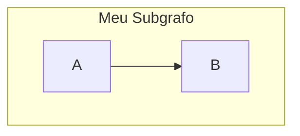
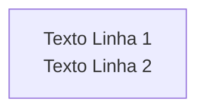

# Manual de Boas Práticas e Pontos de Atenção para Mermaid.js

Este documento serve como uma base de conhecimento para os agentes de IA, contendo lições aprendidas e diretrizes para evitar erros comuns na geração de diagramas Mermaid.

## 1. Direcionamento de Layout (`direction`)

- **Ponto de Atenção:** A diretiva `direction` (ex: `direction TD` ou `direction LR`) é instável e causa erros de renderização quando declarada dentro de `subgraph`.
- **Boa Prática:** Declare a direção do layout **apenas uma vez**, no início do diagrama (nível superior), usando `graph TD`, `graph LR`, etc. Os subgrafos herdarão essa direção. Não inclua `direction` dentro de subgrafos.

**Exemplo Errado:**


**Exemplo Correto:**


## 2. Quebras de Linha em Nós (`nodes`)

- **Ponto de Atenção:** O uso de tags HTML como `<br>` para forçar quebras de linha dentro do texto de um nó causa erros de análise (`Parse error`).
- **Boa Prática:** Para criar um texto com múltiplas linhas, use **quebras de linha literais** (pressionando Enter) e envolva todo o texto do nó com **aspas duplas (`""`)**.

**Exemplo Errado:**
```mermaid
graph TD
    A[Texto Linha 1<br>Texto Linha 2] // <-- ISTO CAUSA ERRO
```

**Exemplo Correto:**

